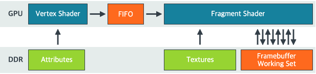
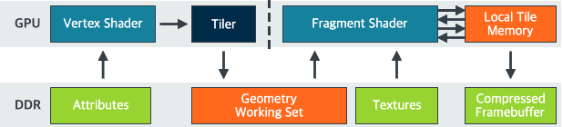
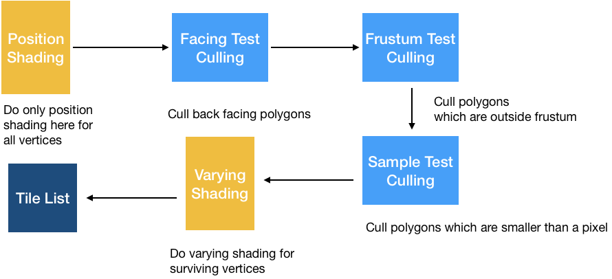
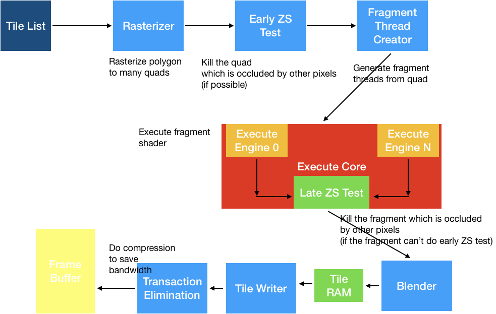

# Mali GPU Architecture & Vulkan

## Introduction of Mali GPU
Like other embedded IP cores for 3D rendering acceleration, the Mali GPU does not include display controllers driving monitorings, in contract to common desktop video cards. Instead the Mali ARM core is a pure 3D engine that renders graphics into memory and passes the rendered image over to another core to handle display.  

### Link
> Mali GPU Wiki Link(한국어): [Mali GPU Wiki Kr](https://ko.wikipedia.org/wiki/%EB%A7%90%EB%A6%AC_(GPU)) 
> Mali GPU Wiki Link(English): [Mali GPU Wiki En](https://en.wikipedia.org/wiki/Mali_(GPU))

## Tile-Based Rendering
* Mali GPUs use a tile-based rendering architecture.  
* GPU renders the output framebuffer as several distinct smaller sub-regions called tiles
* With Mali GPUs, these tiles are small, spanning just 16x16 pixels each

### Immediate Mode GPUs
* Traditional Desktop GPU Architecture
* Process rendering as a strict command stream, executing the vertex and fragment shaders in sequence on each primitive in every draw call 

#### Advantages
* The output of the vertex shader, and other geometry related shaders, can remain on-chip inside the GPU
* GPU uses little external memory bandwidth storing and retrieving intermediate geometry results

#### Disadvantages
* High resolutions the bandwidth load placed on this memory can be very high because of multiple read-modify-write operations for each fragment

### Tile-Based GPUs
* Tile-Based GPUs is designed to minimize the amount of external memory accesses the GPU needs during fragment shading
* Tile-Based renders split the screen into small pieces and fragment shade each small tile to completion before writing it out to memory 

## Vertex Pass of Render Pass

## Fragment Pass of Render Pass

## Related resources
> Mali GPU Best Practice : [Best Practice Link](https://developer.arm.com/solutions/graphics/developer-guides/mali-gpu-best-practices) 
> Vulkan Best Practice : [Best Practice Link](https://github.com/ARM-software/vulkan_best_practice_for_mobile_developers)